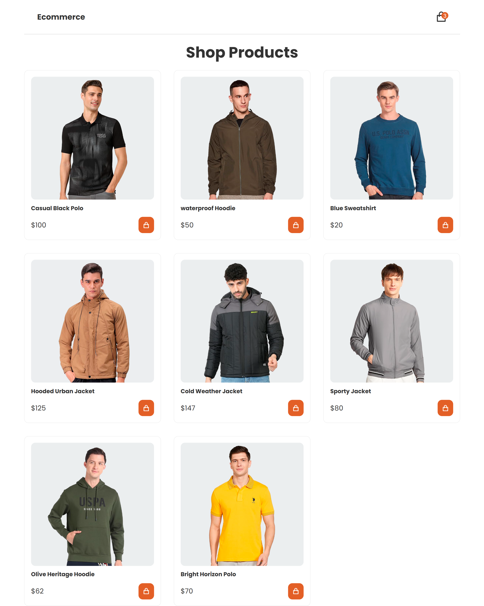

# Cart Shopping 🛒

## Live Demo

🔗 [View Project](https://osama-dev20.github.io/Cart-Shopping/)

---

## Preview



---

## Overview

Cart Shopping is a responsive e-commerce shopping cart application built using **HTML, CSS, and JavaScript**.

The project provides an interactive shopping experience where users can browse products, add items to their cart, manage quantities, remove products, and calculate the total price dynamically.

This project was developed to strengthen my front-end development skills and practice real-world concepts such as **DOM manipulation, event handling, dynamic content creation, and responsive design**.

---

## Features

✨ Fully responsive product layout.

🛒 Add products to the shopping cart.

🚫 Prevent adding duplicate products.

➕ Increase product quantity.

➖ Decrease product quantity.

🗑 Remove products from the cart.

🔢 Dynamic cart item counter.

💰 Automatic total price calculation.

📱 Interactive cart sidebar.

✅ Order confirmation modal.

---

## Technologies Used

- HTML5
- CSS3
- JavaScript (ES6)
- CSS Grid & Flexbox
- Remix Icon
- Google Fonts (Poppins)

---

## JavaScript Concepts Applied

- DOM Manipulation
- Event Listeners
- Template Literals
- Functions
- Query Selector API
- Event Target & Closest Method
- Dynamic Element Creation
- Working with Dynamic Components

---

## Project Structure

```text
Cart Shopping
│
├── screenshots
│   └── preview.png
│
├── assets
│   └── images
│
├── src
│   ├── css
│   │   └── style.css
│   │
│   └── js
│       └── main.js
│
└── index.html